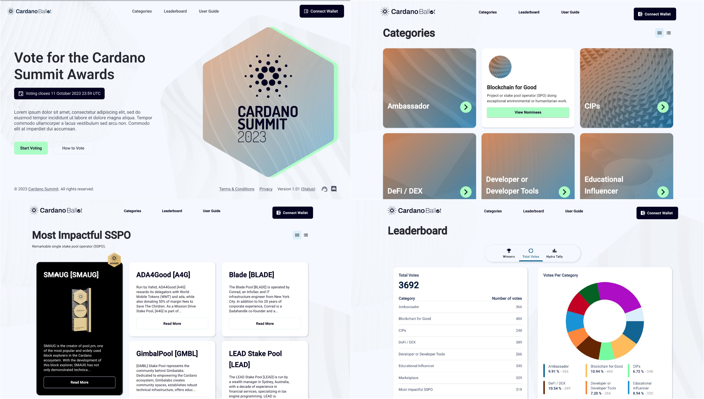

# Summit 2023 UI

<p align="left">
<a href="https://conventionalcommits.org"></a>
</p>

# Overview

Summit 2023 UI application has been developed using [ReactJS](https://react.dev/), [MUI](https://mui.com/), [Redux](https://redux.js.org/) and [i18n](https://www.i18next.com/). This frontend application features mainly Category, Nominee and Leaderboard pages by interfacing with our backend services, through a Rest API. The application also integrates Web3 component [Cardano Connect with Wallet](https://github.com/cardano-foundation/cardano-connect-with-wallet) for user registration.

You can visit now the website that hosts this app using [this link](https://voting.summit.cardano.org/).



## Getting started

### Requirements
- Node.js 18.x LTS

### Available Scripts

In the project directory, you can run:

#### `npm install`

This will install all packages in node_modules folder.

#### `npm start`

Runs the app in the development mode.\
Open [http://localhost:3000](http://localhost:3000) to view it in the browser.

The page will reload if you make edits.\
You will also see any lint errors in the console.

#### `npm run build`

Builds the app for production to the `build` folder.\
It correctly bundles React in production mode and optimizes the build for the best performance.

The build is minified and the filenames include the hashes.\
Your app is ready to be deployed!

## Running backend services in localhost

To run the backend services you will need to open multiple terminals and follow this instructions:

### Terminal 1 - [Data follower app](/backend-services/vote-commitment-app/) on port: 9090
Edit ``application.properties``:
1. Comment CIP-1694 Pre Ratification start block.
2. Uncomment CF Summit 2023 start block
```bash
cd voting-ledger-follower-app
./gradlew bootRun

```
### Terminal 2 - [Voting app](/backend-services/voting-app/) on port: 9091
```bash
cd voting-app
./gradlew bootRun
```

### Terminal 3 - [Vote verification app](/backend-services/voting-verification-app/) on port: 9092
```bash
cd voting-verification-app
./gradlew bootRun
```

### Terminal 4 - [User verification app](/backend-services/user-verification-service/) on port: 9093
```bash
export AWS_SNS_ACCESS_KEY_ID=...
export AWS_SNS_SECRET_ACCESS_KEY=...
cd user-verification-service
./gradlew bootRun
```

## Content Mapping

The UI application populates the content (Presentation Names, Urls, Description, Links etc...) from a JSON by mapping Category ids and Proposal ids which were generated by Backend service.

The current ```summit-2023``` application's content is fetching from [this JSON](src/common/resources/data/summit2023Content.json).

